# 🚀 Web2APK Pro

  
  
  
  

  <h3 align="center"> The Ultimate Web-to-Native Android APK Builder & Management Toolkit</h3>
  

    A premium Proof of Concept (POC) showcasing the seamless conversion of web applications into fully functional, permission-aware Android APKs with background execution and real-time diagnostics.
  

  <a href="#-about-this-poc">About</a> •
  <a href="#-visual-showcase">Showcase</a> •
  <a href="#-feature-matrix">Features</a> •
  <a href="#-permission-matrix">Permissions</a> •
  <a href="#-author">Author</a>

---

## 🎯 About This POC

This repository is a **Proof of Concept (POC) Showcase**. It does not contain source code. Instead, it serves as a comprehensive visual documentation and feature demonstration of the **Web2APK Pro** tool. 

It proves the end-to-end capability of the tool: from the **Node.js web builder interface** to **APK generation**, **Android installation**, **runtime permission handling**, and **native utility modules**.

---

## 🖼️ Visual Showcase

### 🖥️ Phase 1: Web Builder Interface (Node.js Backend)

| Server Initialization | Configuration UI |
| :---: | :---: |
| 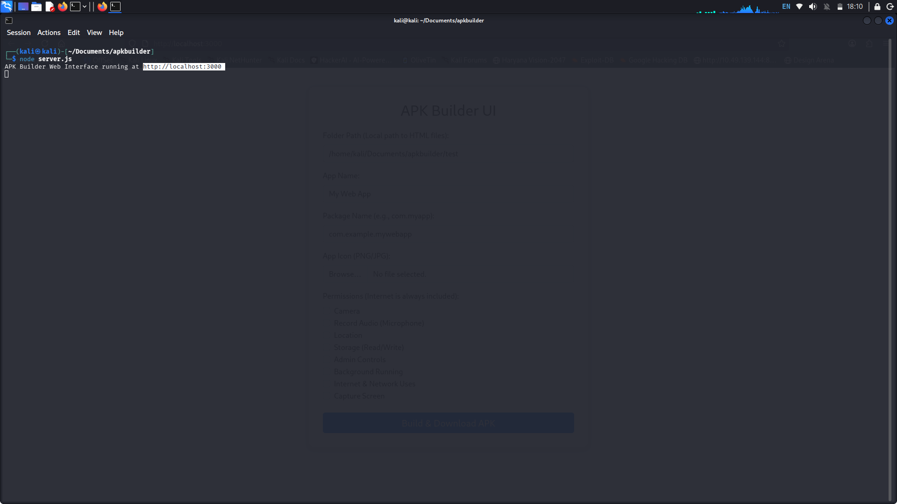 | 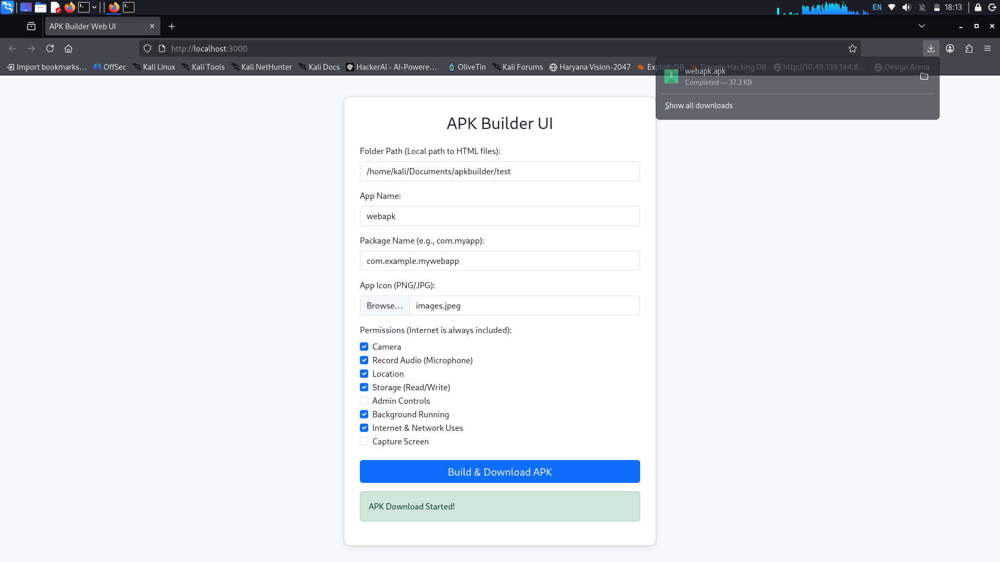 |
| *Terminal launching the builder on `localhost:3000`* | *Successful build: "APK Download Started!" (37.3 KB)* |

| Asset Management | Clean Interface |
| :---: | :---: |
| 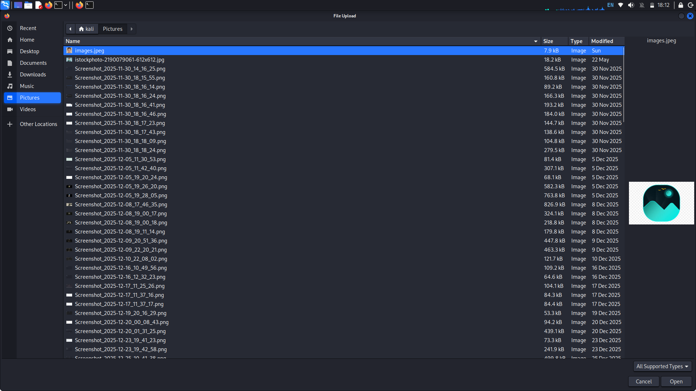 | 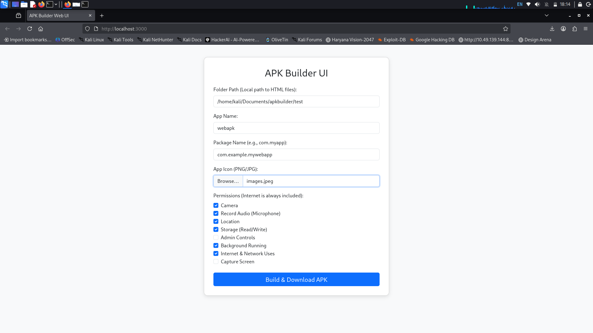 |
| *Custom PNG/JPG icon selection via native file picker* | *Clean, intuitive configuration form* |

---

###  Phase 2: Android Installation & Execution

| Installation | File System |
| :---: | :---: |
| 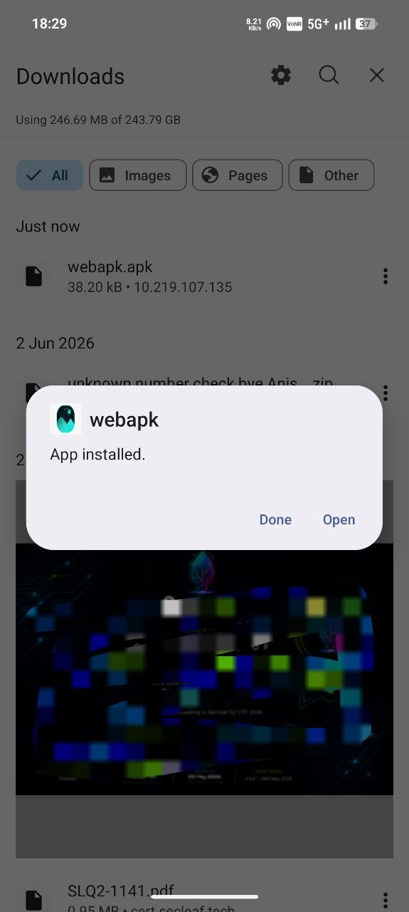 |  |
| *Native Android "App installed" notification* | *Generated `webapk.apk` in device storage* |

| Launcher Integration |
| :---: |
| 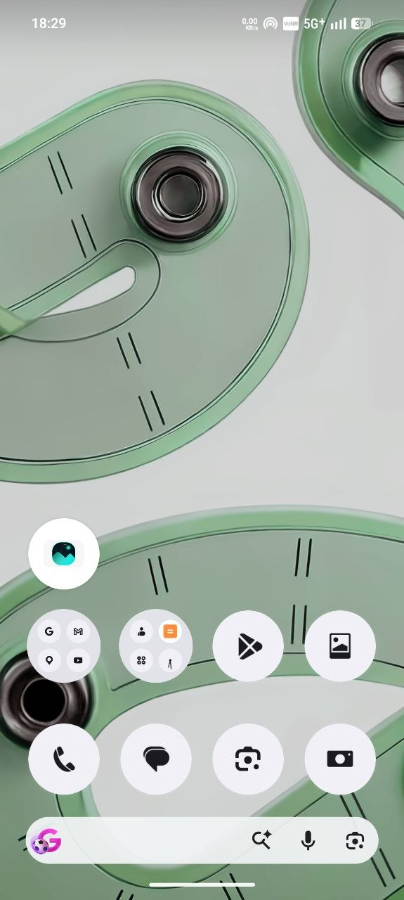 |
| *Custom app icon successfully installed on Android launcher* |

---

### 🔐 Phase 3: Granular Permission System (Runtime)

| Camera Request | Camera Verified | Audio Request |
| :---: | :---: | :---: |
| 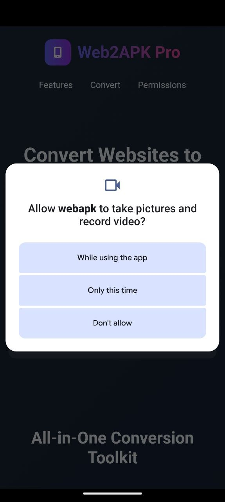 | 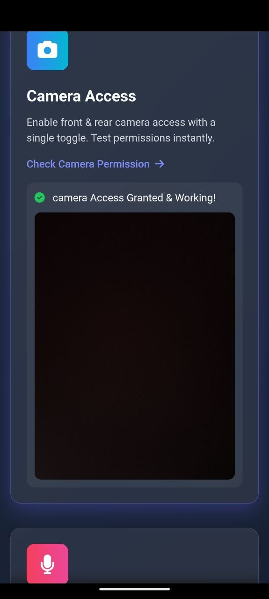 | 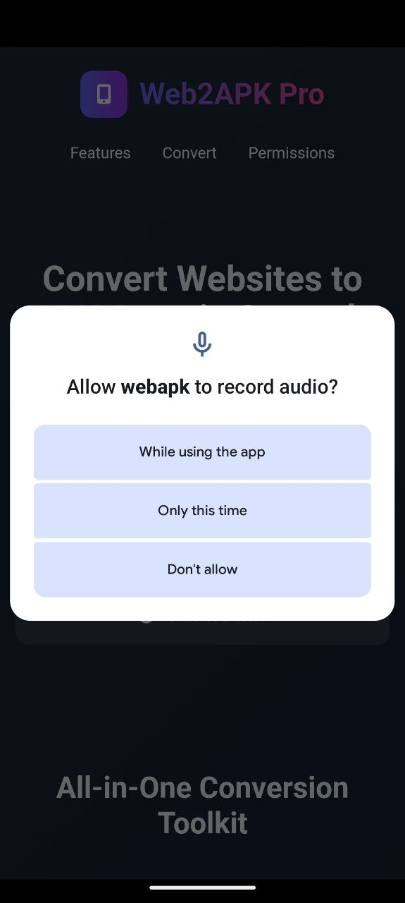 |
| *Native Camera/Video prompt* | *Viewfinder active & granted* | *Microphone access prompt* |

| Location (Granular) | Storage (Elevated) |
| :---: | :---: |
| 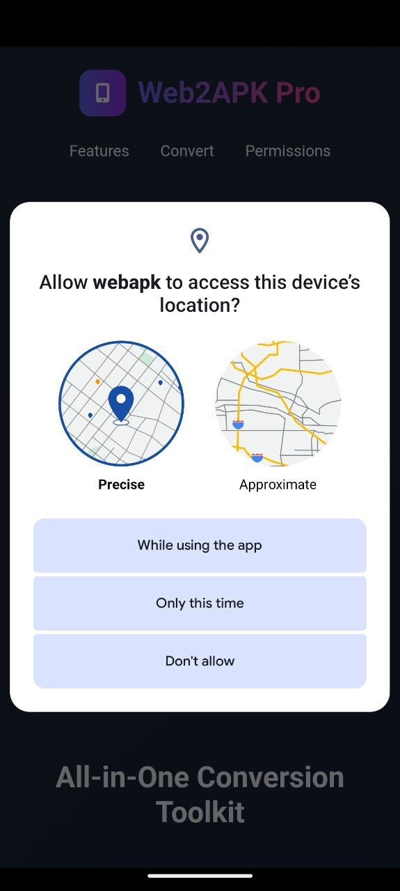 | 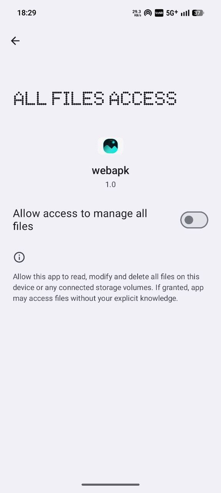 |
| *Precise vs. Approximate selection* | *MANAGE_EXTERNAL_STORAGE for v1.0* |

---

### ⚙️ Phase 4: Background Execution & Utilities

| Background Service | Network Diagnostics |
| :---: | :---: |
| 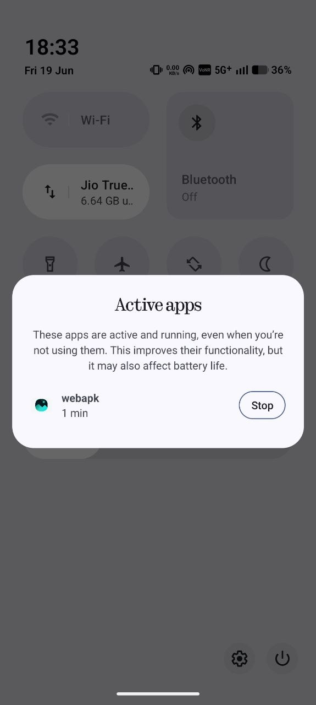 | 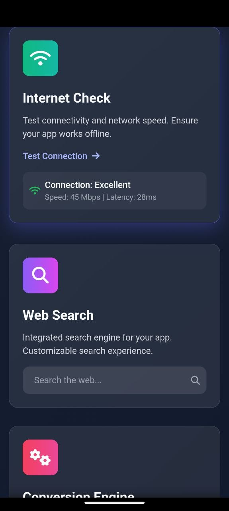 |
| *System-level "Active apps" management* | *Real-time speed (45 Mbps) & latency (28ms)* |

| Web Search Engine | Search Results |
| :---: | :---: |
| 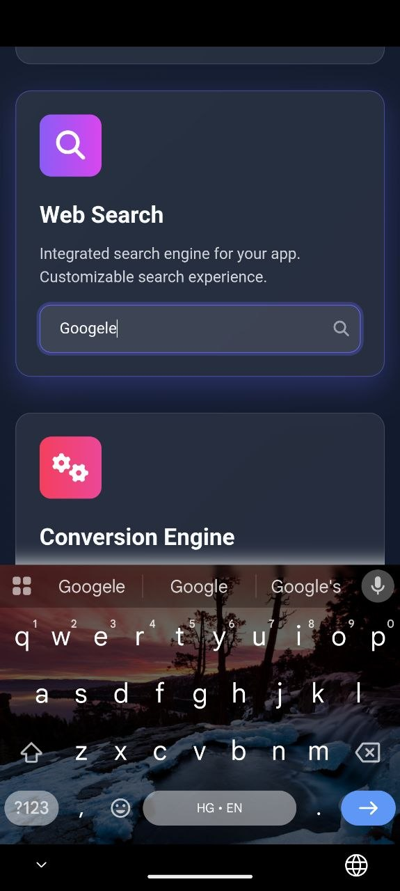 | 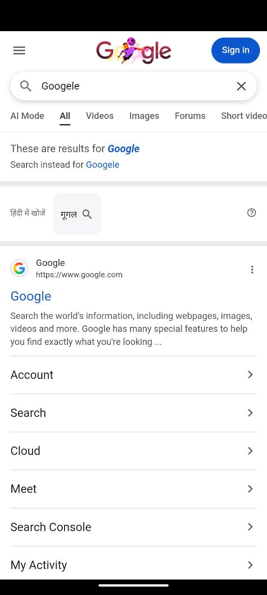 |
| *Integrated in-app search bar* | *Google results rendered in WebView* |

| File Uploads |
| :---: |
| 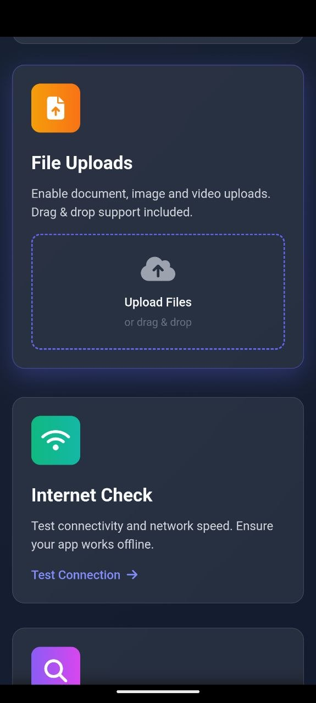 |
| *Drag & drop document/media support* |

---

## 🟣 Feature Matrix

| 🟢 Feature | 🔵 POC Verification |
| :--- | :--- |
| **⚡ Node.js Backend** | Proven via terminal server startup on port 3000. |
| **🎨 Custom Branding** | Proven via App Name, Package Name, and Icon Upload UI. |
| **🛡️ Granular Permissions** | Proven via runtime dialogs for Camera, Audio, Location, and Storage. |
| **🔄 Background Execution** | Proven via Android "Active apps" system dialog. |
| **📶 Network Diagnostics** | Proven via "Internet Check" module showing live Mbps/ms. |
| **🔍 Web Search** | Proven via in-app search rendering external Google results. |
| **📂 File Uploads** | Proven via drag-and-drop UI module. |
| **🚀 Real-Time Build** | Proven via instant 37.3 KB APK generation and download. |

---

## ️ Permission Matrix

Web2APK Pro adheres to strict Android security guidelines, requesting only necessary permissions at runtime.

| 🔒 Permission |  Android Constant | 🎯 Purpose | 🟢 User Control |
|:---|:---|:---|:---|
| **Internet** | `INTERNET` | Web rendering and network diagnostics. | Install-time |
| **Camera** | `CAMERA` | Photo/video capture via WebView. | Runtime Prompt |
| **Microphone** | `RECORD_AUDIO` | Audio input for web applications. | Runtime Prompt |
| **Fine Location** | `ACCESS_FINE_LOCATION` | GPS-level accuracy (user-selectable). | Runtime Prompt |
| **Coarse Location**| `ACCESS_COARSE_LOCATION`| Network-based location (privacy-friendly).| Runtime Prompt |
| **Storage** | `MANAGE_EXTERNAL_STORAGE`| Full file management and drag-drop access. | Runtime Prompt |
| **Background** | `FOREGROUND_SERVICE` | Persistent background execution. | System Managed |

---

## 👤 Author & Portfolio

Developed and designed by **Mandeep Parmar**  
 [LinkedIn Profile](https://www.linkedin.com/in/mandeep-parmar-b73a54381)  
💼 GitHub: [@hacksben](https://github.com/hacksben)

### 🧰 More Professional Tools by the Author:
- 🔍 **Omni-Scanner** - Advanced OSINT tool covering 600+ sites.
-  **WiFi Infinite Deauth Attack** - WiFi security research tool.
- 🐧 **Linux Imager** - Professional AppImage builder.

---

## ️ License & Disclaimer

This project is licensed under the **MIT License**. See the [LICENSE](LICENSE) file for details.

> ⚠️ **[!IMPORTANT] LEGAL DISCLAIMER**  
> This Proof of Concept is intended strictly for **legitimate development, educational purposes, and authorized security research**. Ensure you have the explicit right to package and distribute the web content you are converting. The author assumes no responsibility for any misuse of this software.

---

  <b>⭐ If you find this POC useful, please consider giving this repository a Star! ⭐</b>

